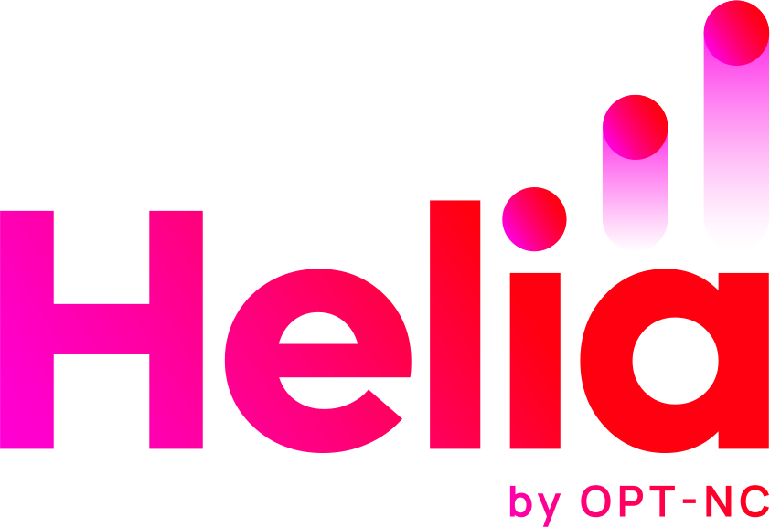
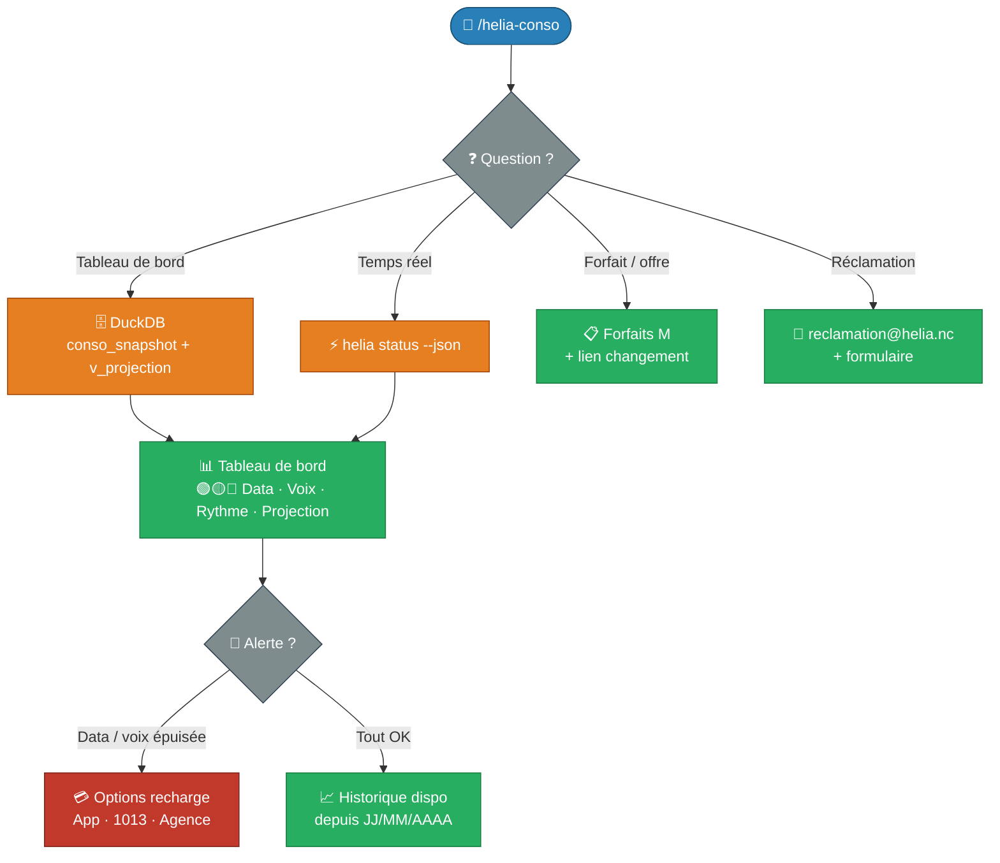

# 📱 Helia NC — Ma consommation mobile



!!! info "Commande Claude Code"

    **Commande** : `/helia-conso`  
    **Tags** : :material-tag-outline: `helia` :material-tag-outline: `mobile` :material-tag-outline: `consommation` :material-tag-outline: `opt-nc`  
    **Source** : [:fontawesome-brands-github: Voir le code source](https://github.com/adriens/claude-commands/blob/main/docs/skills/helia-conso/src/helia-conso.md)

    *Tableau de bord data/voix/SMS, projection de fin de forfait, recharges et gestion du forfait Helia NC.*

---

## 📡 Contexte

**[Helia](https://helia.nc/)** est la marque mobile de l'**OPT-NC**, anciennement Mobilis. Ce skill se concentre sur le **suivi de ta consommation personnelle** : combien il reste, si ça va tenir jusqu'au renouvellement, et comment recharger si besoin.

Il s'appuie sur :
- Le **CLI `helia`** — interroge l'API OPT-NC en temps réel
- Une base **DuckDB** alimentée toutes les 5 min — historique, tendances, projections

> Pour la qualité du réseau, les maintenances et la latence API → voir [`/helia-reseau`](../helia-reseau/index.md)

---

## 📥 Installation

### Prérequis

```bash
# DuckDB CLI (pour les requêtes historiques)
brew install duckdb
```

> Le CLI `helia` et la base `~/.config/helia/data/helia.db` doivent être configurés au préalable.

### Skill (Slash Command)

```bash
mkdir -p ~/.claude/commands && \
curl -o ~/.claude/commands/helia-conso.md \
  https://raw.githubusercontent.com/adriens/claude-commands/main/docs/skills/helia-conso/src/helia-conso.md
```

---

## 📝 Utilisation

```text
/helia-conso
```

Sans argument → tableau de bord complet (data, voix, SMS, hors-forfait, rythme, projection).

```text
/helia-conso data
/helia-conso voix
/helia-conso projection
/helia-conso recharge
```

---

## ✨ Fonctionnalités

- 📶 **Data** : Go restants, % consommé, rythme jour par jour
- 📞 **Voix** : heures restantes, % consommé, conso par jour
- 💬 **SMS** : illimité ou quota restant
- 💸 **Hors-forfait** : montant en F CFP
- ⏱ **Rythme** : % data consommée vs % temps écoulé (en avance / dans les clous / dépasse)
- 🏁 **Projection** : data et voix tiennent-elles jusqu'au renouvellement ?
- 💳 **Recharges** : options packagées, internet mobile, agences, app
- 📋 **Forfaits** : tableau comparatif M 2/10/30/100 Go + changement de forfait
- 🗂 **Réclamations** : formulaire, email, courrier

---

## 🔀 Flow de travail


