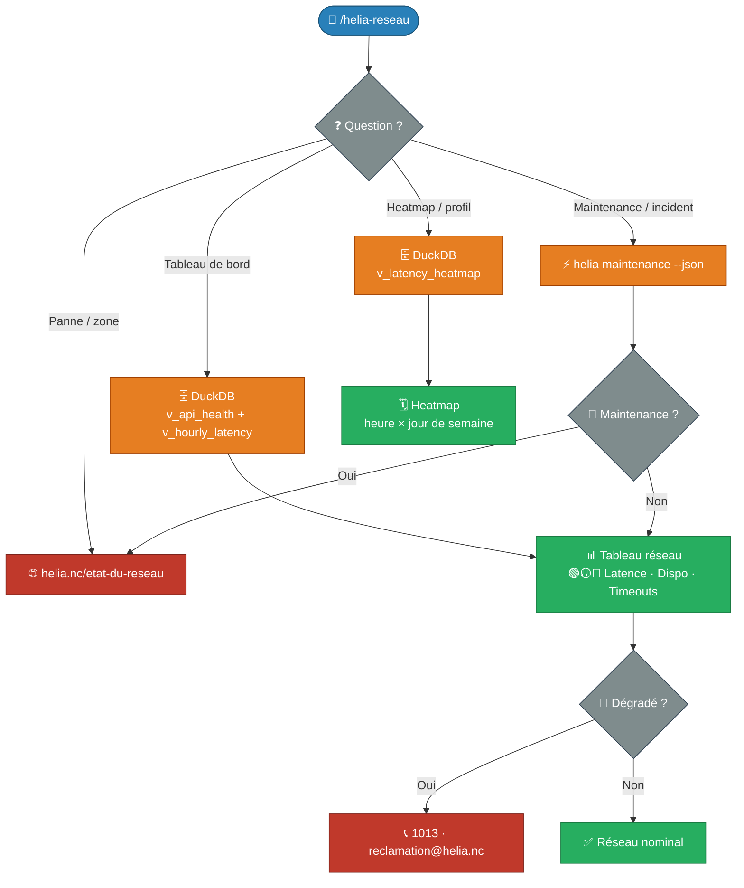

# 📡 Helia NC — Qualité du réseau mobile

!!! info "Commande Claude Code"

    **Commande** : `/helia-reseau`  
    **Tags** : :material-tag-outline: `helia` :material-tag-outline: `réseau` :material-tag-outline: `latence` :material-tag-outline: `maintenance` :material-tag-outline: `opt-nc`  
    **Source** : [:fontawesome-brands-github: Voir le code source](https://github.com/adriens/claude-commands/blob/main/docs/skills/helia-reseau/src/helia-reseau.md)

    *Latence API, disponibilité, profil horaire, maintenances programmées et incidents réseau Helia NC.*

---

## 📡 Contexte

Ce skill se concentre sur la **qualité du réseau mobile Helia NC** : est-ce que l'API répond vite ? Y a-t-il une maintenance en cours ? Quelles sont les meilleures heures pour une connexion rapide ?

Il s'appuie sur :
- La table **`api_ping`** — mesure de latence toutes les 5 min, stockée dans DuckDB
- Le **CLI `helia maintenance`** — état des services en temps réel
- Les vues SQL `v_api_health`, `v_hourly_latency`, `v_latency_heatmap`

> Pour la consommation data/voix, les forfaits et les recharges → voir [`/helia-conso`](../helia-conso/index.md)

---

## 📥 Installation

### Prérequis

```bash
# DuckDB CLI (pour les requêtes historiques)
brew install duckdb
```

> Le CLI `helia` et la base `~/.config/helia/data/helia.db` doivent être configurés au préalable.

### Skill (Slash Command)

```bash
mkdir -p ~/.claude/commands && \
curl -o ~/.claude/commands/helia-reseau.md \
  https://raw.githubusercontent.com/adriens/claude-commands/main/docs/skills/helia-reseau/src/helia-reseau.md
```

---

## 📝 Utilisation

```text
/helia-reseau
```

Sans argument → tableau de bord réseau complet (latence, dispo, meilleures/pires heures).

```text
/helia-reseau latence
/helia-reseau maintenance
/helia-reseau incident
/helia-reseau heatmap
```

---

## ✨ Fonctionnalités

- 🟢/🟡/🔴 **Latence API** : moyenne, P95, max (dernière heure)
- ⛔ **Timeouts** : nombre et taux sur la période
- 📶 **Disponibilité** : % global et par jour
- ⏰ **Profil horaire** : meilleures et pires heures de la journée
- 🗓 **Heatmap** : latence par heure × jour de semaine
- 🔧 **Maintenances** : services en cours de maintenance via `helia maintenance --json`
- 🗺 **Incidents** : redirection vers [helia.nc/etat-du-reseau](https://helia.nc/etat-du-reseau)

---

## 🔀 Flow de travail


