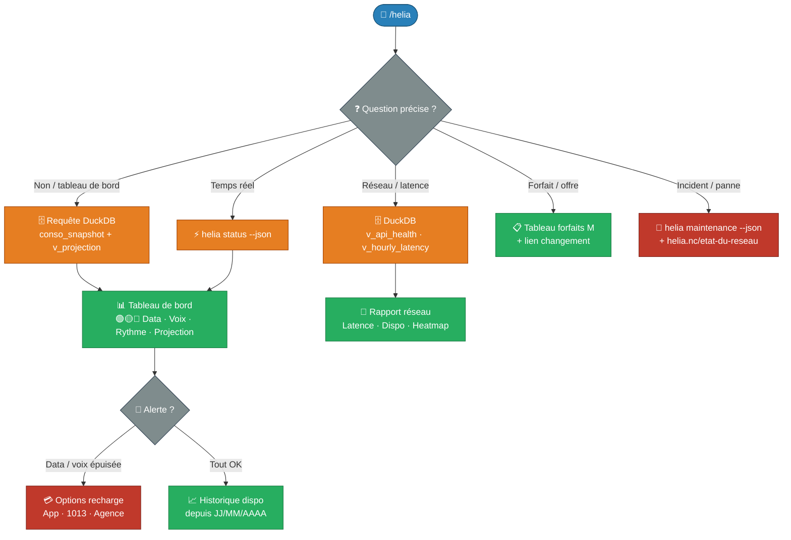

# 📱 Helia / Mobilis — Mon forfait mobile

!!! info "Commande Claude Code"

    **Commande** : `/helia`  
    **Tags** : :material-tag-outline: `helia` :material-tag-outline: `mobile` :material-tag-outline: `opt-nc` :material-tag-outline: `nouvelle-calédonie`  
    **Source** : [:fontawesome-brands-github: Voir le code source](https://github.com/adriens/claude-commands/blob/main/docs/skills/helia/src/helia.md)

    *Suivi de consommation data & voix, performances réseau et gestion de ton forfait mobile Helia NC.*

---

## 📡 Qu'est-ce que Helia ?

**[Helia](https://helia.nc/)** est la marque mobile de l'**OPT-NC** (Office des Postes et Télécommunications de Nouvelle-Calédonie), anciennement connue sous le nom **Mobilis**. Elle propose des forfaits M (abonnement mensuel) et des kits prépayés Liberté, sur un réseau couvrant l'ensemble de la Nouvelle-Calédonie (530+ antennes, 8 200 km de fibre).

Ce skill s'appuie sur :

- Le **CLI `helia`** — outil local qui interroge l'API OPT-NC en temps réel
- Une base **DuckDB** alimentée toutes les 5 minutes — pour l'historique, les tendances et les projections
- Les **vues SQL** précalculées — `v_projection`, `v_daily_conso`, `v_api_health`, `v_hourly_latency`

---

## 📥 Installation

### Skill (Slash Command)
```bash
mkdir -p ~/.claude/commands && \
curl -o ~/.claude/commands/helia.md \
  https://raw.githubusercontent.com/adriens/claude-commands/main/docs/skills/helia/src/helia.md
```

> **Prérequis** : le CLI `helia` doit être installé et configuré (`~/.config/helia/token`) ainsi que la base DuckDB `~/.config/helia/data/helia.db`.

---

## 📝 Utilisation

```text
/helia
```

Sans argument, le skill affiche le **tableau de bord complet** : data, voix, SMS, hors-forfait, rythme et projection.

```text
/helia data
/helia voix
/helia réseau
/helia latence
```

---

## ✨ Fonctionnalités

### Domaine 1 — Consommation
- 📶 **Data** : Go restants, % consommé, rythme jour par jour
- 📞 **Voix** : heures restantes, % consommé
- 💬 **SMS** : illimité ou quota
- 💸 **Hors-forfait** : montant en F CFP
- ⏱ **Rythme** : % data consommée vs % temps écoulé (en avance / dans les clous / dépasse)
- 🏁 **Projection** : data et voix tiennent-elles jusqu'au renouvellement ?

### Domaine 2 — Qualité réseau & API
- 🟢/🟡/🔴 Latence API (≤500 ms / 500–1000 ms / >1000 ms)
- ⛔ Timeouts et taux de disponibilité
- 📊 Profil horaire (meilleures / pires heures de la journée)
- 🗓 Heatmap heure × jour de semaine

### Domaine 3 — Offres & forfaits
- Tableau des forfaits M (2 / 10 / 30 / 100 Go)
- Kits prépayés Liberté
- Changement de forfait sans frais après le 1er mois

### Domaines 4–7
- **App Helia** — fonctionnalités par type de forfait
- **Assistance** — numéros 1000 / 1013 / 1052, agences sans RDV
- **État du réseau** — maintenances et incidents temps réel
- **Réclamations** — formulaire, email, courrier

---

## 🔀 Flow de travail


