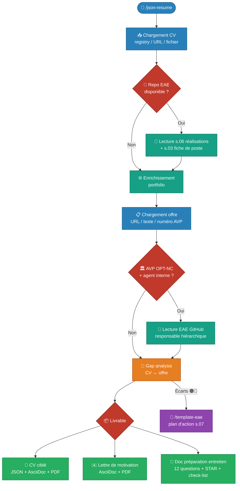

# 📄 Analyse CV JSON Resume


!!! info "Commande Claude Code"

    **Commande** : `/json-resume`  
    **Tags** : :material-tag-outline: `cv` :material-tag-outline: `emploi` :material-tag-outline: `json-resume`  
    **Source** : [:fontawesome-brands-github: Voir le code source](https://github.com/adriens/claude-commands/blob/main/docs/skills/json-resume/src/json-resume.md)

    *Analyse complète d'un CV JSON Resume : synthèse, gap analysis avec une offre, pitch et lettre de motivation.*

---

## 📖 Qu'est-ce que JSON Resume ?

[JSON Resume](https://jsonresume.org/) est un standard open source communautaire qui définit un schéma JSON universel pour les CV. L'idée : stocker son CV dans un fichier `resume.json` structuré et interopérable, indépendant de tout outil de mise en forme.

Avantages :
- **Versionnable** : stocké dans un Gist ou un repo Git, l'historique est conservé
- **Interopérable** : un seul fichier source, des dizaines de thèmes de rendu disponibles
- **Exploitable par l'IA** : structure normalisée → facile à analyser, comparer, adapter

Le registry officiel (`registry.jsonresume.org/{username}`) publie automatiquement tout Gist GitHub public nommé `resume.json`.

---

## 🔗 Prérequis

Un CV publié au format [JSON Resume](https://jsonresume.org/) :

- Via le registry : créer un Gist public nommé `resume.json` → disponible sur `registry.jsonresume.org/{username}`
- Ou via n'importe quelle URL publique pointant vers un fichier JSON conforme au schéma JSON Resume

---

## 📥 Installation

```bash
curl -o ~/.claude/commands/json-resume.md \
  https://raw.githubusercontent.com/adriens/claude-commands/main/docs/skills/json-resume/src/json-resume.md
```

---

## 📝 Utilisation

```text
/json-resume adriens
```

```text
/json-resume https://raw.githubusercontent.com/username/repo/main/resume.json
```

```text
/json-resume
```

---

## ✨ Fonctionnalités

- 🔗 **Chargement automatique** depuis `registry.jsonresume.org/{username}`, une URL ou un fichier local
- 📊 **Synthèse du profil** : expériences, compétences, réalisations notables
- 🎯 **Gap analysis** CV ↔ offre d'emploi avec tableau d'adéquation coloré
- 🗣️ **Pitch** : 3 variantes (LinkedIn, entretien, email spontané)
- ✍️ **Lettre de motivation** personnalisée en Markdown ou AsciiDoc, exportable en Word

---

## 🔀 Flow de travail


