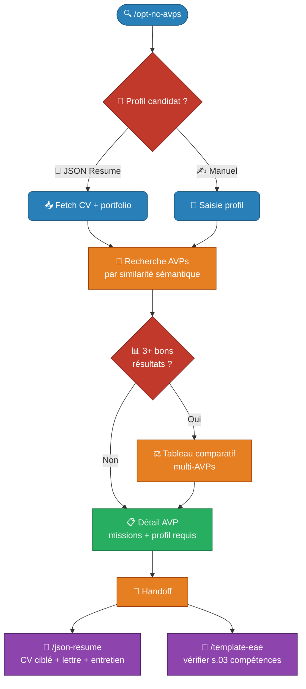

# 🔍 Recherche d'AVPs OPT-NC


!!! info "Commande Claude Code"

    **Commande** : `/opt-nc-avps`  
    **Tags** : :material-tag-outline: `emploi` :material-tag-outline: `opt-nc` :material-tag-outline: `nouvelle-calédonie`  
    **Source** : [:fontawesome-brands-github: Voir le code source](https://github.com/adriens/claude-commands/blob/main/docs/skills/opt-nc-avps/src/opt-nc-avps.md)

    *Accompagnement complet à la préparation de candidature pour l'OPT-NC.*

---

## 🏛️ Contexte : OPT-NC et AVPs

### L'OPT-NC

L'[Office des Postes et Télécommunications de Nouvelle-Calédonie (OPT-NC)](https://opt.nc/) est un établissement public calédonien qui gère les services postaux, les télécommunications et les services financiers (CCP) sur l'ensemble du territoire. C'est l'un des principaux employeurs publics de Nouvelle-Calédonie.

### Qu'est-ce qu'un AVP ?

Un **Avis de Vacance de Poste (AVP)** est l'équivalent calédonien d'une offre d'emploi dans la fonction publique. Les AVPs sont publiés par la **Direction des Ressources Humaines de la Fonction Publique de Nouvelle-Calédonie (DRHFPNC)** et recensent les postes ouverts au sein des administrations et établissements publics du territoire.

Contrairement aux offres d'emploi privées, les AVPs obéissent à des règles spécifiques :

- **Lettre sous couvert hiérarchique** : la candidature doit transiter par la hiérarchie de l'agent
- **EAE (Entretien Annuel d'Évaluation)** : souvent demandé en pièce jointe
- **Délai de clôture strict** : les candidatures hors délai ne sont pas acceptées

Les AVPs de l'OPT-NC sont publiés en open data sur [data.gouv.nc](https://data.gouv.nc/explore/dataset/avis-de-vacances-de-poste-avp-drhfpnc/) et mis à jour régulièrement.

---

## 📥 Installation

L'installation se fait en deux étapes dans votre terminal Claude Code.

### 1️⃣ Serveur MCP (Prérequis)
Installez d'abord le serveur de données :
```bash
claude mcp add avps-opt-nc \
  --transport sse \
  https://opt-nc-avps.hf.space/gradio_api/mcp/sse
```

### 2️⃣ Skill (Slash Command)
Téléchargez le skill dans votre répertoire de commandes :
```bash
mkdir -p ~/.claude/commands && \
curl -o ~/.claude/commands/opt-nc-avps.md \
  https://raw.githubusercontent.com/adriens/claude-commands/main/docs/skills/opt-nc-avps/src/opt-nc-avps.md```
---

## 📝 Utilisation

Une fois installé, dans Claude, lancez simplement la commande en précisant votre profil ou le type de poste :

```text
/opt-nc-avps chef de projet SI
```

### ✨ Fonctionnalités
*   🔍 **Recherche ciblée** des postes ouverts.
*   🧠 **Profilage intelligent** via questionnaire.
*   🛠️ **Plan de préparation** (atouts, points à renforcer, questions d'entretien STAR).
*   ✍️ **Aide à la rédaction** de lettre de motivation personnalisée.

---

## 🔀 Flow de travail


